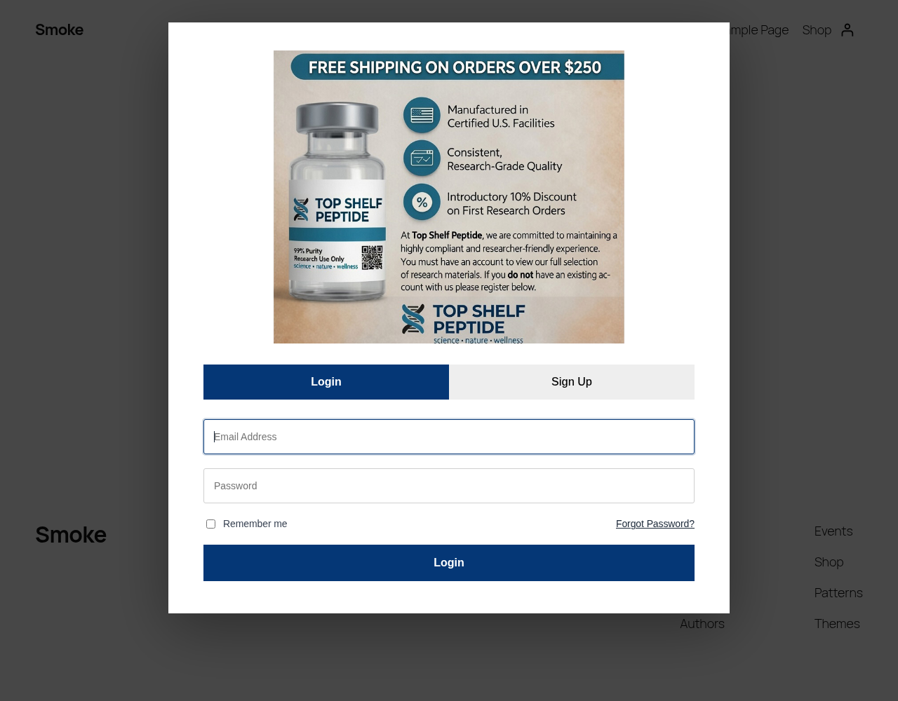

# Auth Gate Popup

A WordPress plugin that gates the entire site behind a non-dismissible login / registration popup and requires login before WooCommerce purchases.




## Features

- **Forced auth popup** shown to every logged-out visitor on the front end.
- **Non-dismissible**: no close button, and the Escape key is blocked.
- **Login, sign-up and forgot password** views in a single modal, all submitted over AJAX.
- **Registration from the popup** with first name, last name, email and password (min. 8 characters).
- **Configurable terms checkbox**: custom text (links allowed), optional or required, or hidden entirely. Consent time is stored per user.
- **Auto-login after registration**, followed by a page reload.
- **Password reset feedback**: a short-lived cookie shows a "password changed" message the next time the popup is displayed.
- **Configurable offer image and alt text**, with a media library picker, bundled default artwork and automatic fallback if a custom image fails to load.
- **Admin base color** setting that drives the popup accent color through a CSS custom property.
- **WooCommerce integration**: guests cannot purchase products or add them to the cart.
- **Activation setup**: enables public registration and sets the default role to `customer` (or `subscriber` if WooCommerce is not active).
- **Translation ready**: `auth-gate-popup` text domain with a bundled `.pot` file.

## Screenshots

| Login view |
|------------|
|  |

The popup artwork shown is the bundled default image. It is sample artwork from the author's own site, [topshelfpeptide.com](https://topshelfpeptide.com), and should be replaced with your own image in the settings.

## Installation

1. Download the latest release zip (or clone this repository into `wp-content/plugins/`).
2. In WordPress admin, go to **Plugins > Add New > Upload Plugin** and upload the zip.
3. Activate **Auth Gate Popup**.

```bash
cd wp-content/plugins
git clone https://github.com/lawrancebabu/auth-gate-popup.git
```

## Configuration

Go to **Settings > Auth Gate Popup**:

| Setting                  | Description                                                                   | Default                                               |
|--------------------------|-------------------------------------------------------------------------------|-------------------------------------------------------|
| Popup image              | Offer image at the top of the popup (about 790 x 686). Empty uses the bundled artwork. | `assets/top-shelf-popup.jpg`                 |
| Image alt text           | Alternative text for the popup image.                                         | `Sign in to continue`                                 |
| Base color               | Hex color used for tabs, buttons and accents.                                 | `#053776`                                             |
| Registration terms text  | Text next to the Sign Up checkbox. `a`, `strong` and `em` tags allowed. Empty hides the checkbox. | `I agree to the Terms of Service and Privacy Policy.` |
| Require terms checkbox   | Whether the checkbox must be ticked to register.                              | On                                                    |

Settings are stored in a single option, `agp_options`.

## How It Works

### Hooks used

| Hook | Type | Purpose |
|------|------|---------|
| `init` | action | Loads translations and runs the one-time legacy data migration. |
| `wp_enqueue_scripts` | action | Enqueues popup CSS/JS for logged-out visitors and injects the accent color. |
| `wp_body_open` (priority 1), `wp_footer` | action | Renders the popup markup once (footer is a fallback for themes without `wp_body_open`). |
| `wp_ajax_nopriv_agp_login` | action | AJAX login via `wp_signon()`. |
| `wp_ajax_nopriv_agp_register` | action | AJAX registration via `wp_create_user()`, then `wp_set_auth_cookie()`. |
| `wp_ajax_nopriv_agp_lost_password` | action | AJAX password reset email via `retrieve_password()`. |
| `password_reset`, `woocommerce_customer_reset_password` | action | Sets a 5-minute HttpOnly cookie used to show a reset success message. |
| `admin_menu`, `admin_init`, `admin_enqueue_scripts` | action | Settings page, Settings API registration and media picker script. |
| `woocommerce_is_purchasable` | filter | Returns `false` for guests. |
| `woocommerce_add_to_cart_validation` | filter | Blocks add-to-cart for guests and adds a WooCommerce notice. |
| `register_activation_hook` | activation | Enables registration, sets default role, migrates legacy data, seeds default options. |

### Excluded requests

The popup is not rendered for logged-in users, wp-admin, AJAX and REST requests, feeds, `robots.txt`, `wp-login.php` / `wp-register.php`, and password reset URLs, so users can always complete login and reset flows.

### Data keys

| Key | Type | Purpose |
|-----|------|---------|
| `agp_options` | option | Plugin settings. |
| `agp_migration_version` | option | Marks the legacy data migration as done. |
| `agp_terms_agreed` | user meta | Date/time the user accepted the terms at registration. |
| `agp_password_reset_success` | cookie | 5-minute flag for the reset success message. |

Versions before 1.1.0 used `alphalabs_*` keys. On activation (or the first `init` after upgrading) the plugin copies the old settings option and `alphalabs_terms_agreed` user meta to the new keys once. Old data is copied, not deleted.

### Security measures

- `ABSPATH` direct-access guard on the main file; `WP_UNINSTALL_PLUGIN` guard on `uninstall.php`.
- Nonce (`wp_create_nonce` / `wp_verify_nonce`) on every AJAX form.
- AJAX handlers registered only as `nopriv`, so they are available to logged-out visitors only.
- Input sanitized with `sanitize_email`, `sanitize_text_field`, `sanitize_key`, `sanitize_user` and `wp_unslash`; passwords are passed to core untouched, as core expects.
- Settings sanitized in a Settings API callback (`esc_url_raw`, `sanitize_hex_color`, `sanitize_text_field`, `wp_kses` with a small allowlist); settings page restricted to `manage_options`.
- All output escaped with `esc_html`, `esc_attr`, `esc_url`, `esc_textarea` and `wp_kses`.
- Generic "invalid email address or password" error on failed login.
- Auth cookies set with `is_ssl()` awareness; reset cookie is HttpOnly and Secure on HTTPS.
- No direct SQL: all data access goes through WordPress core APIs.
- Code checked with PHP_CodeSniffer using WordPress Coding Standards and PHPCompatibilityWP (`phpcs.xml.dist`).

## Activation, Deactivation and Uninstall

- **Activation** turns on "Anyone can register" and sets the default new user role to `customer` (`subscriber` without WooCommerce).
- **Deactivation** leaves those two site settings unchanged. Review them under **Settings > General** if you no longer want public registration.
- **Uninstall** (deleting the plugin) removes `agp_options`, `agp_migration_version` and the legacy `alphalabs_auth_gate_options` option. Registration settings and per-user consent timestamps are intentionally kept.

## Development

```bash
composer global require wp-coding-standards/wpcs phpcompatibility/phpcompatibility-wp
phpcs            # uses phpcs.xml.dist
wp i18n make-pot . languages/auth-gate-popup.pot --exclude=screenshots
```

## Requirements

- WordPress 6.0 or later
- PHP 7.4 or later
- WooCommerce (optional, for purchase gating and the `customer` role)

## File Structure

```
auth-gate-popup/
├── auth-gate-popup.php       # Main plugin file (bootstrap, hooks, settings, AJAX handlers, migration)
├── uninstall.php             # Removes plugin settings on uninstall
├── assets/
│   ├── auth-gate.css         # Popup styles
│   ├── auth-gate.js          # Popup behavior: tabs, AJAX submit, Escape blocking
│   ├── auth-gate-admin.js    # Media library picker for the settings page
│   └── top-shelf-popup.jpg   # Default popup artwork (sample, from topshelfpeptide.com)
├── languages/
│   └── auth-gate-popup.pot   # Translation template
├── screenshots/
│   └── popup.png
├── phpcs.xml.dist            # Coding standards config
├── readme.txt                # WordPress.org-style readme
├── README.md
├── LICENSE
└── .gitignore
```

## License

GPL-2.0-or-later. See [LICENSE](LICENSE).

## Author

**Lawrance Babu Gain**, Senior PHP / WordPress / Laravel Developer

- GitHub: [@lawrancebabu](https://github.com/lawrancebabu)
- Website: [hubstafftalent.net/profiles/lawrance-babu](https://hubstafftalent.net/profiles/lawrance-babu)
- Email: [lawrance1020@gmail.com](mailto:lawrance1020@gmail.com)
